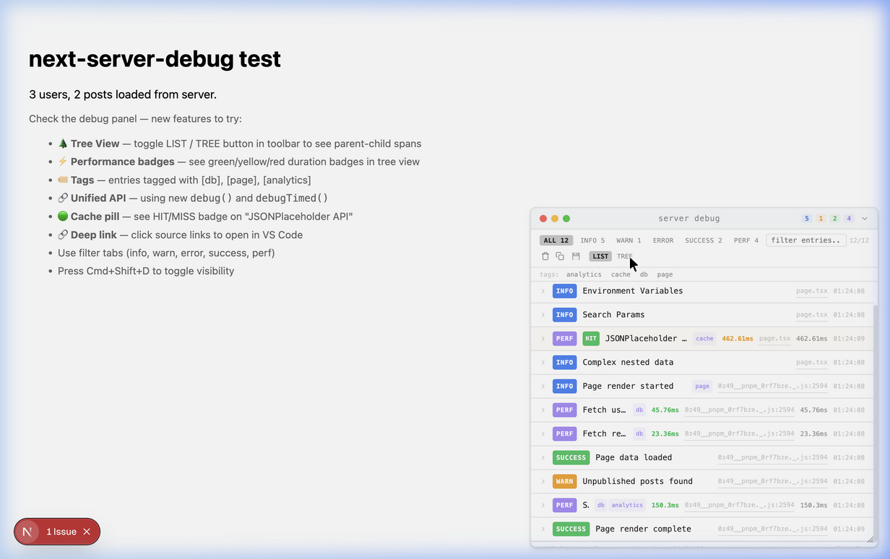
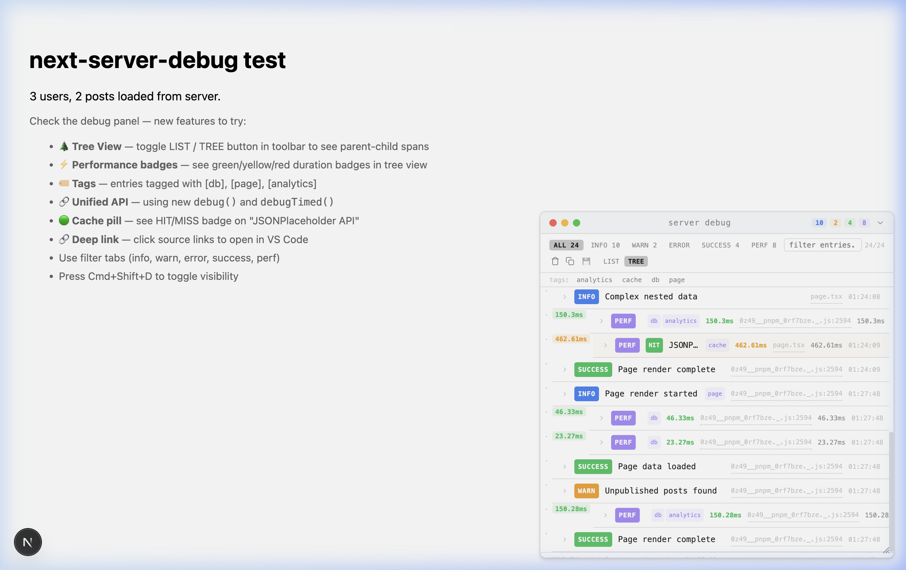

# 🔍 next-server-debug

**Zero-config server-side observability for Next.js App Router**

See everything your server does — fetch calls, DB queries, timings, cache status — in a beautiful floating panel. Zero runtime dependencies. Zero production cost.



<p align="center">
  <a href="./assets/demo.webp">🎬 Watch animated demo</a> · <a href="https://stackblitz.com/github/yogeshmishra667/next-server-debug/tree/main/test-app?file=app/page.tsx">⚡ Try on StackBlitz</a>
</p>

---

> [!CAUTION]
> ## ⚠️ Breaking Changes in v0.6 (New Architecture)
>
> v0.6 introduces a **completely new architecture** with a global store, auto-instrumentation, and tree views.
>
> **What changed:**
> - `createDebugger()` still works but is now **legacy** — use `debug()` and `debugTimed()` instead
> - New global `debugStore` powered by `AsyncLocalStorage` for request-scoped tracing
> - `DebugPanel` now supports **tree view**, **tag filtering**, **persist mode**, and **smart highlighting**
> - New auto-instrumentation: `instrumentFetch()`, `withDebug()`, `withDebugMiddleware()`, `withRouteDebug()`
> - New zero-config plugin: `withServerDebug()` wraps your `next.config.js`
>
> **Migration from v0.5:**
> ```diff
> - import { createDebugger } from "next-server-debug/server";
> - const dbg = createDebugger("source");
> - dbg.log("message", data);
>
> + import { debug, debugTimed } from "next-server-debug/server";
> + debug("message", data, "info", ["tag"]);
> + const result = await debugTimed("operation", () => fetchData(), ["db"]);
> ```
>
> The old API (`createDebugger`, `dbg`) continues to work — no breaking changes to existing code.

---

## ✨ Features

| Feature | Description |
|---------|-------------|
| 🔍 **Debug Panel** | Floating panel with list + tree views, search, and level filtering |
| 🏷️ **Tag Filtering** | Filter entries by tag (db, fetch, analytics, etc.) |
| ⚡ **Performance Badges** | Color-coded duration: 🟢 fast · 🟡 slow · 🔴 critical |
| 🌲 **Tree View** | Hierarchical span tree showing parent-child relationships |
| 💾 **Persist Mode** | Save entries across page reloads via localStorage |
| 🔗 **Deep Links** | Click source file links to open in VS Code |
| 🟢 **Cache Status** | HIT/MISS pills on fetch entries |
| 🔒 **Security** | Auto-redacts sensitive headers and env vars |
| 📦 **Zero Dependencies** | No runtime dependencies — just React + Next.js |
| 🚫 **Zero Production Cost** | Tree-shaken in production — `DebugPanel` returns `null` |

---

## 📦 Install

```bash
npm install next-server-debug
# or
pnpm add next-server-debug
# or
yarn add next-server-debug
```

**Requirements:** Next.js 14+ with App Router, React 18+

---

## 🚀 Quick Start (2 minutes)

### Step 1: Add to your page

```tsx
// app/page.tsx
import { debug, debugTimed } from "next-server-debug/server";
import { DebugPanel } from "next-server-debug";

export default async function Page() {
  // Log anything
  debug("Page loaded", { route: "/" }, "info", ["page"]);

  // Time async operations
  const users = await debugTimed("Fetch users", async () => {
    return await db.user.findMany();
  }, ["db"]);

  // That's it! Pass entries to the panel
  const { debugStore } = await import("next-server-debug/server");
  
  return (
    <main>
      <h1>{users.length} users</h1>
      <DebugPanel entries={debugStore.getEntries()} />
    </main>
  );
}
```

### Step 2: Open your app

The debug panel appears in the bottom-right corner. Press **`Cmd+Shift+D`** to toggle visibility.

**That's it!** 🎉 No config files, no providers, no build plugins needed.

---

## 📖 Usage Guide

### Basic Logging

```tsx
import { debug } from "next-server-debug/server";

// Simple log
debug("Something happened", { key: "value" });

// With level: "info" | "warn" | "error" | "success" | "perf"
debug("Warning!", { count: 0 }, "warn");

// With tags for filtering
debug("Query executed", { rows: 42 }, "info", ["db", "analytics"]);
```

### Timing Operations

```tsx
import { debugTimed } from "next-server-debug/server";

// Returns the result of your async function
const users = await debugTimed("Fetch users from DB", async () => {
  return await prisma.user.findMany();
}, ["db"]);

// Duration is automatically recorded and color-coded:
// 🟢 < 200ms  |  🟡 200-1000ms  |  🔴 > 1000ms
```

### Inspecting Request Context

```tsx
import { inspectHeaders, inspectEnv, inspectSearchParams, inspectCache } from "next-server-debug/server";

// Headers (sensitive ones auto-redacted)
const headers = await inspectHeaders("app/page.tsx");

// Environment variables (secrets auto-redacted)
const env = inspectEnv(["NODE_ENV", "DATABASE_URL", "API_KEY"], "app/page.tsx");

// URL search params
const params = inspectSearchParams(await searchParams, "app/page.tsx");

// Fetch with cache status (HIT/MISS pill)
const { data, entry } = await inspectCache(
  "GitHub API",
  "https://api.github.com/repos/vercel/next.js",
  undefined,
  "app/page.tsx"
);
```

---

## 🌲 Tree View

Switch to **TREE** mode in the toolbar to see parent-child span relationships:



---

## ⚡ Auto-Instrumentation

### Instrument Fetch Globally

```ts
// instrumentation.ts (Next.js instrumentation file)
import { instrumentFetch } from "next-server-debug/server";

export function register() {
  instrumentFetch(); // All fetch() calls are now logged automatically
}
```

### Wrap Server Actions

```ts
"use server";
import { withDebug } from "next-server-debug/server";

async function createUser(formData: FormData) {
  const name = formData.get("name") as string;
  return await db.user.create({ data: { name } });
}

export const createUserAction = withDebug("createUser", createUser);
```

### Wrap Middleware

```ts
// middleware.ts
import { withDebugMiddleware } from "next-server-debug/server";
import { NextResponse } from "next/server";

export const middleware = withDebugMiddleware(async (req) => {
  // your logic
  return NextResponse.next();
});
```

### Wrap Route Handlers

```ts
// app/api/users/route.ts
import { withRouteDebug } from "next-server-debug/server";
import { NextResponse } from "next/server";

export const GET = withRouteDebug("GET /api/users", async (req) => {
  const users = await db.user.findMany();
  return NextResponse.json(users);
});

export const POST = withRouteDebug("POST /api/users", async (req) => {
  const body = await req.json();
  const user = await db.user.create({ data: body });
  return NextResponse.json(user, { status: 201 });
});
```

---

## 🔌 ORM Plugins

### Prisma

```ts
import { withDebugLogging } from "next-server-debug/prisma";

const prisma = new PrismaClient().$extends(withDebugLogging());
// All queries automatically appear in the debug panel
```

### Drizzle

```ts
import { createDrizzleDebugLogger } from "next-server-debug/drizzle";
import { drizzle } from "drizzle-orm/node-postgres";

const db = drizzle(pool, {
  logger: createDrizzleDebugLogger(),
});
```

---

## ⚙️ Zero-Config Plugin

Wrap your `next.config.js` for global configuration:

```js
// next.config.js
import { withServerDebug } from "next-server-debug/plugin";

export default withServerDebug(
  { /* your Next.js config */ },
  {
    thresholds: { slow: 300, critical: 2000 },
    autoInstrumentFetch: true,
    terminalLogging: true,
    maxEntriesPerRequest: 500,
  }
);
```

---

## 🎨 DebugPanel Props

```tsx
<DebugPanel
  entries={entries}           // DebugEntry[] — required
  theme="auto"                // "dark" | "light" | "auto"
  defaultCollapsed={false}    // start collapsed?
  maxHeight={360}             // panel max height in px
  opacity={0.97}              // panel background opacity
  editorScheme="vscode"       // "vscode" | "webstorm" | "cursor"
  projectRoot={process.cwd()} // for source file deep links
  title="server debug"        // panel title
/>
```

### Panel Features

| Toolbar Button | Action |
|---------------|--------|
| 🗑️ Clear | Remove all entries |
| 📋 Copy | Copy entries as JSON |
| 💾 Persist | Toggle localStorage persistence |
| **LIST** / **TREE** | Switch between list and tree view |
| `tags: db analytics ...` | Click to filter by tag |
| Filter tabs | Filter by level (info, warn, error, success, perf) |
| Search box | Full-text search across labels and data |

**Keyboard shortcut:** `Cmd+Shift+D` (Mac) / `Ctrl+Shift+D` (Windows) — toggle panel visibility

---

## 🧩 Works With Everything

| Library | Compatibility | How |
|---------|--------------|-----|
| **Redux / Zustand / Jotai** | ✅ No conflicts | Different layer (client vs server) |
| **React Query / SWR** | ✅ Works | Server-side prefetches auto-logged |
| **Axios** | ✅ Works | Wrap with `debugTimed()` (not auto-instrumented) |
| **Prisma** | ✅ Auto-logged | Use `withDebugLogging()` plugin |
| **Drizzle** | ✅ Auto-logged | Use `createDrizzleDebugLogger()` |
| **tRPC** | ✅ Works | Wrap procedures with `withDebug()` |
| **fetch()** | ✅ Auto-logged | Via `instrumentFetch()` |

> [!NOTE]
> `instrumentFetch()` only patches `globalThis.fetch`. HTTP clients like Axios use `XMLHttpRequest` and are **not** auto-instrumented. Wrap Axios calls with `debugTimed()` for manual logging.

---

## 🔒 Security

- **Headers:** `Authorization`, `Cookie`, `x-api-key` are auto-redacted by `inspectHeaders()`
- **Env vars:** Values containing `secret`, `key`, `password`, `token` are auto-redacted by `inspectEnv()`
- **Production:** `DebugPanel` returns `null`, all debug functions are no-ops, code is tree-shaken
- **No network:** Debug data flows through React's RSC serialization — no extra API calls

---

## 🧪 Chrome Extension Support

The `DebugPanel` exposes entries for browser extensions:

```js
// Listen for updates
window.addEventListener("next-server-debug", (event) => {
  const { entries, version, timestamp } = event.detail;
  console.log(entries.length, "debug entries");
});

// Or read directly
const bridge = window.__NEXT_SERVER_DEBUG__;
if (bridge) console.log(bridge.entries);
```

---

## 🏗️ Architecture

```text
┌─────────────────────────────────────────────────┐
│  Server (Node.js)                               │
│                                                 │
│  AsyncLocalStorage ──► DebugStore (singleton)    │
│       │                    │                     │
│  debug() / debugTimed()    │                     │
│  inspectHeaders()          │                     │
│  instrumentFetch()       entries[]                │
│  withDebug()               │                     │
│  withRouteDebug()          │                     │
│  withDebugMiddleware()     │                     │
│       │                    ▼                     │
│       └──────────► RSC Serialization             │
│                         │                        │
└─────────────────────────│────────────────────────┘
                          ▼
┌─────────────────────────────────────────────────┐
│  Client (Browser)                               │
│                                                 │
│  DebugPanel ◄── entries (via props/context)      │
│       │                                         │
│  List View / Tree View / Tag Filter / Persist   │
│  window.__NEXT_SERVER_DEBUG__ (extension bridge) │
└─────────────────────────────────────────────────┘
```

**Key design decisions:**
- **No network requests** — data flows through React's built-in RSC serialization
- **Per-request isolation** — `AsyncLocalStorage` ensures entries don't leak between requests
- **Zero production cost** — every function checks `NODE_ENV` and becomes a no-op

---

## 📚 Full API Reference

### `next-server-debug/server`

| Export | Type | Description |
|--------|------|-------------|
| `debug(label, data?, level?, tags?)` | Function | Log a debug entry |
| `debugTimed(label, fn, tags?)` | Async Function | Time an async operation and return its result |
| `debugStore` | Object | Global store — `getEntries()`, `clearEntries()`, `configure()` |
| `createDebugger(source)` | Function | *Legacy* — creates a namespaced debugger |
| `dbg` | Object | *Legacy* — quick-access `dbg.info()`, `dbg.warn()`, etc. |
| `inspectHeaders(source?)` | Async Function | Inspect request headers (redacts sensitive) |
| `inspectEnv(keys, source?)` | Function | Inspect env variables (redacts secrets) |
| `inspectSearchParams(params, source?)` | Function | Inspect URL search params |
| `inspectCache(label, url, options?, source?)` | Async Function | Fetch with cache status detection |
| `instrumentFetch()` | Function | Auto-instrument all `fetch()` calls |
| `withDebug(name, fn)` | Function | Wrap server actions |
| `withDebugMiddleware(fn)` | Function | Wrap middleware |
| `withRouteDebug(name, fn)` | Function | Wrap route handlers (GET, POST, etc.) |

### `next-server-debug`

| Export | Type | Description |
|--------|------|-------------|
| `DebugPanel` | Component | Floating debug panel (returns `null` in production) |
| `DebugProvider` | Component | Context provider with `mode="auto"` support |
| `useDebug()` | Hook | Access debug entries from context |

### `next-server-debug/plugin`

| Export | Type | Description |
|--------|------|-------------|
| `withServerDebug(config, options?)` | Function | Zero-config Next.js wrapper |

### `next-server-debug/prisma`

| Export | Type | Description |
|--------|------|-------------|
| `withDebugLogging(options?)` | Function | Prisma `$extends` plugin |

### `next-server-debug/drizzle`

| Export | Type | Description |
|--------|------|-------------|
| `createDrizzleDebugLogger()` | Function | Drizzle logger adapter |

---

## 🏠 Monorepo Usage

If using workspaces (Turborepo, Nx), install at the root:

```bash
pnpm add -w next-server-debug
```

Then import normally in any app within the workspace.

---

## 🛠️ Development

```bash
git clone https://github.com/yogeshmishra667/next-server-debug.git
cd next-server-debug
pnpm install
pnpm dev        # watch mode
pnpm build      # production build
pnpm test       # 75 tests across 5 suites
pnpm typecheck  # TypeScript check
```

### Demo App

```bash
cd test-app
pnpm install
pnpm dev
# Open http://localhost:3000
```

---

## 📄 License

MIT
